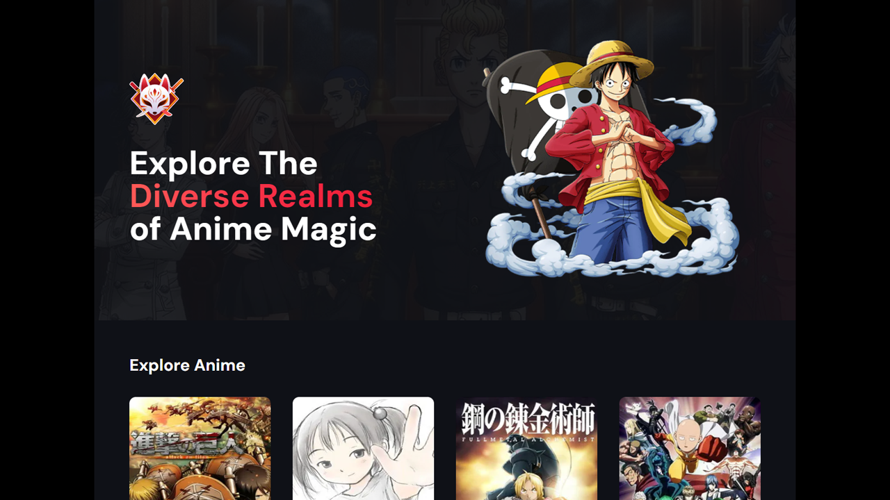

  

# 🐱‍🏍 Anime Infinit List
Projeto de um site de Animes com uma lista infinita animada.

- Veja o projeto: [Live Preview](https://victtor-anime-list.vercel.app/)

## ⚙️ Funcionalidades

- [x] Site com uma lista (infinita) de animes organizada por popularidade;
- [x] Utiliza uma API para pegar os dados e ir preechendo a lista;
- [x] Site totalmente responsivel e com animações;
- [x] Feito usando as últimas tecnologias como Next.js, Tailwind, FramerMotion...;

## 🚀 Tecnologias

- [HTML](https://www.w3schools.com/html/)
- [CSS](https://developer.mozilla.org/pt-BR/docs/Web/CSS)
- [TypeScript](https://www.typescriptlang.org/)
- [React](https://react.dev/)
- [Next.js](https://nextjs.org/)

## 📝 Considerações

Projeto do canal do Youtube JavaScript Mastery, eu segui esse projeto para práticar o Next.js e outros assuntos, e porque eu gostei do projeto.
